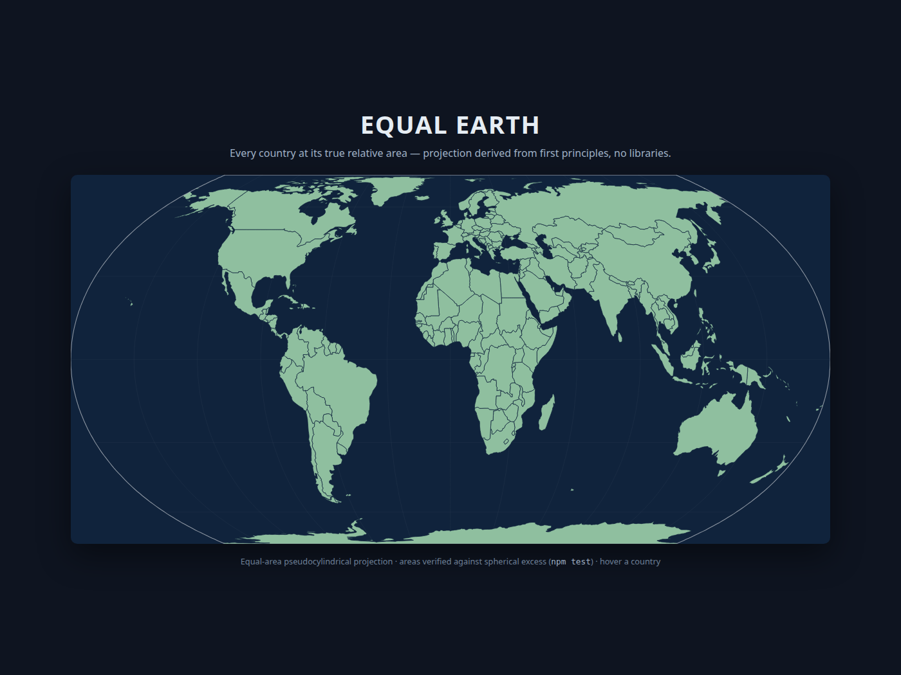

# Equal Earth — a true-area world map

An interactive world map in which **every country is drawn at its true relative
area**: Greenland is ~1/14 of Africa, not "the same size". Built completely from
scratch — the projection is _derived_ here (see [`docs/MATH.md`](docs/MATH.md)),
and there are **zero libraries**: no d3, no proj4, no map SDK.



## Run it

```bash
npm run serve      # static server via python3 (port 8000)
# open http://localhost:8000             — the main map (hover, click to pin)
# open http://localhost:8000/?pin=Greenland — deep link to a pinned country
# open http://localhost:8000/compare.html — published vs our coefficients
```

```bash
npm test           # 43 tests: math invariants + the equal-area proof
```

## What's inside

| Path                 | Purpose                                                                                                |
| -------------------- | ------------------------------------------------------------------------------------------------------ |
| `src/projection.js` | The projection itself: forward `(φ,λ)→(x,y)`, inverse (own Newton solver), y-curve, coefficient sets (`PUBLISHED_A`, `OURS_A`, `OURS_FIXED_ASPECT_A`) |
| `src/area.js` | Verification math: signed spherical excess, shoelace, great-circle densification, longitude unwrapping |
| `src/geo.js` | GeoJSON traversal (Polygon / MultiPolygon) |
| `src/render.js` | Projected SVG paths, graticule, map outline (coefficients pluggable) |
| `src/distortion.js` | Tissot indicatrix + ω metrics used to fit/verify our coefficients |
| `src/main.js` | Fetches data, mounts the SVG, wires hover/pin/ghost interactions |
| `src/stats.js` | Per-country facts for the info card: true area, world share, Mercator inflation |
| `src/compare.js` + `compare.html` | Side-by-side: published vs our coefficients with Tissot circles + metrics |
| `scripts/fit-coefficients.js` | Deterministic Nelder–Mead refit of the y-curve (`node scripts/fit-coefficients.js`) |
| `docs/MATH.md` | Full derivation from the equal-area condition down to the code (§8: our coefficients) |
| `data/world.geojson` | Natural Earth 110m countries (public domain), `data/download.sh` refetches it |
| `test/` | 43 tests across 7 files |

## The math in one paragraph

A map is equal-area iff its Jacobian satisfies `det ∂(x,y)/∂(λ,φ) = cos φ`.
For the pseudocylindrical family `y = Y(θ)`, `x = (2/√3)·λ·cos θ / Y′(θ)` this
collapses to `k·cos θ·dθ/dφ = cos φ`, which integrates to
`sin θ = (√3/2)·sin φ`. Notably, the y-curve `Y` vanishes from the condition —
**any** monotonic y-curve is exactly equal-area; the published Equal-Earth
coefficients only tune *shape* distortion, never area — which is why we were
able to refit them ourselves against our own Tissot-ω criterion
([`docs/MATH.md`](docs/MATH.md) §8, compare at `/compare.html`).
Full derivation with all steps: [`docs/MATH.md`](docs/MATH.md).

## How "equal-area" is proven (not asserted)

1. **Local proof** — finite-difference Jacobian over a lat/lon grid:
   `det / cos φ = 1` to within `1.8e-10`.
2. **Global proof** — for each of the 177 countries, spherical area (signed
   spherical excess, van Oosterom–Strackee) vs projected planar area (shoelace
   over great-circle-densified rings): ratio within **0.18%** worst-case.
3. **Independent cross-checks** — Antarctica computed three ways (spherical fan,
   Green's theorem in `(λ, sin φ)`, projected shoelace) agrees to 5 significant
   digits; 9 countries' absolute areas match published values within 4.2%.
4. **External oracle** — PROJ's published `+proj=eqearth` output validates our
   independent implementation (tests only, never used in code).

## Design decisions

- **JavaScript, zero deps** — the map is an interactive web page; SVG gives
  per-country `<path>` elements with native hover/click for free.
- **Own Newton solver for the inverse** — the y-curve is strictly monotonic, so
  a bracketed Newton with bisection fallback converges exactly; no published
  regression series needed.
- **Own antimeridian handling** — longitudes are unwrapped before projection;
  pole-to-pole legs keep their raw Δλ because on this projection _the pole is a
  line_ (folding it away silently changes the region being measured).
- **Mercator ghost, aligned by map width** — the size-comparison overlay
  renders each country's Mercator outline at the same world width as this map
  (`x` scaled by `2/√3`, so both match at the equator), centered on the
  country's map centroid: a shape that visibly dwarfs the truth as |φ| grows.

## Status

- [x] Projection math derived, implemented, tested
- [x] Equal-area verified end-to-end (34 tests green)
- [x] Interactive SVG map with hover
- [x] Phase 5: our own coefficients (`OURS_A`, `OURS_FIXED_ASPECT_A`) — worst-case
      ω 109.5° → 104.1°, polar band 80.1° → 72.1°, equator held, RMS +2.8% (the
      honest trade); `compare.html` shows all three maps with Tissot indicatrices
- [x] Phase 6: interactions — hover area readouts (true km² + % of Earth),
      click-to-pin (Esc / ocean click clears, `?pin=` deep links), Mercator
      size-comparison ghost overlay with toggle

Data: Natural Earth 110m Admin 0 countries (public domain).
